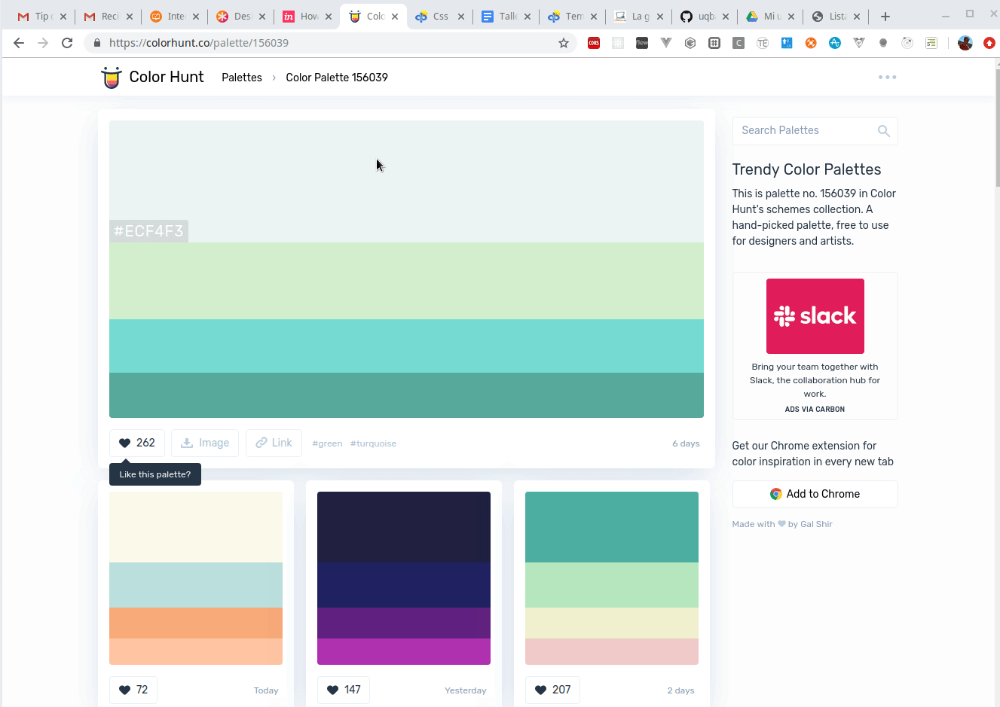

# Taller Maquetado Web

## Etapa 2: Seleccionar la paleta de colores

Elegir la tipografía es difícil, pero todavía hay cosas más complejas: la paleta de colores como [cuenta en este blog mi amiga Gabriela Iztueta](https://blog.10pines.com/2016/07/11/a-little-bit-of-color/), que es diseñadora gráfica. En [este artículo](https://www.invisionapp.com/inside-design/quick-guide-color-palette/) también vamos a tener varias guías para este paso.

No tenemos la restricción de una marca o isotipo que nos fuerce a elegir determinados colores, al menos por ahora, entonces tenemos varios sitios que nos pueden ayudar a elegir una gama de colores que ayude a darle identidad a la página.

```html
https://colourco.de/
https://colorhunt.co/
http://coolors.co/
http://paletton.com/
```

y elegiremos algún color de nuestra preferencia, en nuestro caso: https://colorhunt.co/palette/156039

## Colores a aplicar

### Background color

El color más suave de la paleta, en nuestro caso uno en tonalidad gris y verde muuuy claro.

```css
background-color: #D1EECC
```

### Títulos, subtítulos, encabezados

Cada uno de estos títulos pueden tener diferentes colores en escala de sombras (shades), en este caso no nos parece necesario que cada título tenga diferente color, así que dejaremos los títulos principal y secundario en negro y solo cambiaremos el título 3.

```css
h1, h2 {
  color: black;
}

h3 {
  color: #57A99A;
}
```

### Botones

Es importante diferenciar las acciones (si tengo una botonera con los mismos colores, me cuesta ver a simple vista el Aceptar vs. el Cancelar). También diferenciar botones primarios y secundarios, es importante no asociarlos a colores (verde, azul, no reflejan la importancia o la semántica del botón). Cada botón tiene

- una parte común, definida en la class `button`
- una parte específica, definida en la class `xxxxx-button` como `primary-button`

```css
.primary-button {
  background-color: #57A99A;
}

.secondary-button {
  background-color: gainsboro;
}

.button {
  border: none;
}

.button:hover {
  box-shadow: 0 12px 16px 0 rgba(0,0,0,0.24), 0 17px 50px 0 rgba(0,0,0,0.19);
}
```

Como chiche, vamos a agregar una sombra al botón cuando pasamos por arriba (hover).

### Lista de amigos

El encabezado de la lista sí queremos que destaque respecto a cada una de las filas.

```css
.header {
  background-color: #D1EECC
}
```

## Resultado hasta el momento



## Siguiente paso

- Definiremos el [manejo espacial](https://github.com/uqbar-project/eg-amigos-web/tree/taller-03)