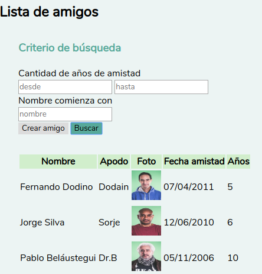
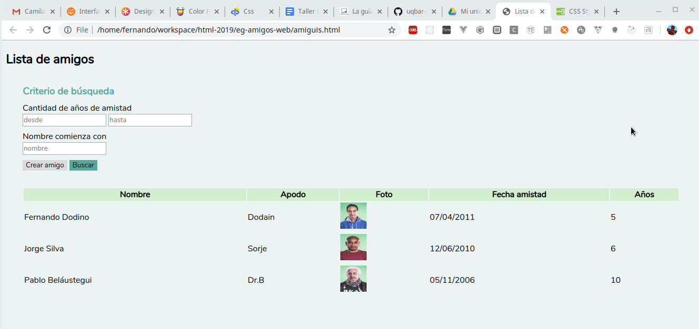
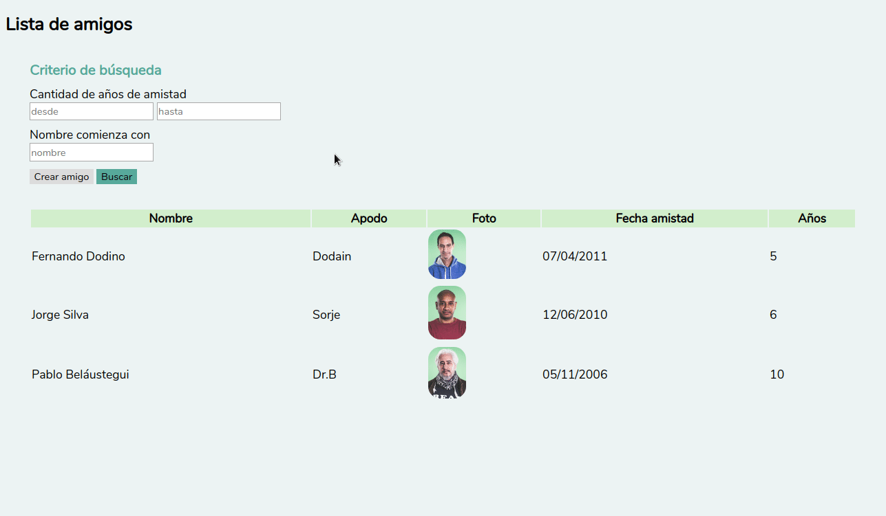
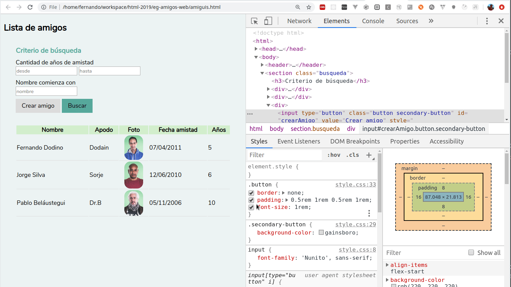
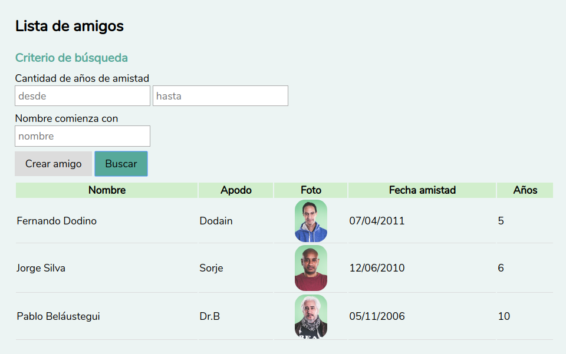

# Taller Maquetado Web

## Etapa 3: Mejoras varias

## Organización de los espacios de la página

Anteriormente dijimos que la página tenía como estructura tres partes:

- el encabezado
- el panel de búsqueda
- la lista de resultados

Pero estas tres secciones están realmente muy juntas, a la organización espacial le falta una separación adecuada. Hay dos variantes para diferenciar ambos contenedores (panel de búsqueda y resultados por ejemplo):

- mediante containers agrupadores con bordes o bien con un color de fondo diferente
- agregando márgenes o paddings como separadores

Vamos a ir por la segunda variante, que logra el mismo efecto en forma más limpia y "ordenada" (lo que en el buen sentido podríamos llamar minimalista o despojado).

```css
section {
  margin: 2rem;
}
```



Ahora se despega también mucho el título del container con los campos de búsqueda, entonces vamos a forzar una separación menor, trabajando con los márgenes verticales (arriba/abajo) y dejando los de la izquierda/derecha tal cual:

```css
h3 {
  color: #57A99A;
  margin: 0.5rem 0;
}
```

Como cuenta [este artículo](https://developer.mozilla.org/es/docs/Web/CSS/margin), si ingresamos margin con dos valores, estamos asignando el valor para el margen vertical primero y el horizontal después.

Y pedimos que el 

Lo mismo hacemos para los divs.

## Anchos

A la tabla le pediremos que ocupe un ancho del 100%.

```css
table {
  width: 100%;
}
```

Con eso la tabla todo el ancho del contenedor y se acomoda dinámicamente.



## Foto

Vamos a mejorar la forma en que se ve la foto, para eso, vamos a utilizar una clase foto

```css
.foto {
  width: 50px;
  height: auto;
  border-radius: 1rem;
}
```

En lugar de estirarse (y deformarse), seteamos el ancho en un tamaño fijo y luego el alto se ajusta automáticamente. También redondeamos los bordes en base al tamaño del root element.



Y al agrandar o achicar la fuente, vemos que la foto se adapta agrandándose y achicándose también.

## Separando las filas suavemente

Para separar cada fila, podemos aplicar estilo al borde inferior (bottom) de cada td:

```css
td {
  border-bottom: 1px solid gainsboro;
}
```

## Alineando la foto

Para alinear la foto, crearemos una clase "centrada" asociada al TD, y conoceremos el estilo `display: flex` que simplifica bastante nuestros problemas de estilo:

```css
.centrada {
  display: flex;
  justify-content: center;
}
```

Este modo de estilo es **realmente flexible** y permite una enorme variedad de combinaciones, [esta página lo explica mejor que nadie](https://css-tricks.com/snippets/css/a-guide-to-flexbox/).

## Mejoramos el estilo de los botones

```css
.button {
  border: none;
  padding: 0.5rem 1rem 0.5rem 1rem;
  font-size: 1rem;
}
```

El [padding](https://developer.mozilla.org/es/docs/Web/CSS/padding) es el espacio interior que ocupa el elemento, el "relleno" entre el elemento y su borde, a diferencia del margin, que es el espacio exterior entre el borde del elemento y su container. A continuación vemos la diferencia activando las herramientas de desarrollo (F12) de tu navegador favorito:



El padding, al igual que el margin se le puede especificar

- 1 parámetro: se aplica a todos los laterales (izquierdo, derecho, superior e inferior)
- 2 parámetros: el primero es el vertical y el segundo el horizontal
- 4 parámetros: siguiendo las agujas del reloj, pensando en las horas 0 3 6 y 9, es decir: arriba, derecha, abajo e izquierda, respectivamente

## Inputs

Aplicamos un estilo adicional a los inputs:

```css
input {
  font-family: 'Nunito', sans-serif;
  /*                */
  font-size: 1rem;
  padding: 0.2rem;
  /*                */
}
```

El padding para agrandar tanto el ancho como el alto, y agrandamos el font-size que el navegador lo achica por su cuenta, para que tenga el mismo tamaño que las etiquetas que tiene arriba. El color del placeholder (la explicación de lo que debe escribir el usuario) está en gris por defecto, no cambiamos esa opción.

## Un último detalle

El título de la lista de amigos no nos quedó con el mismo margen, lo ajustamos:

```css
body {
  ...
  margin: 2rem;
  ...
}
```

y cambiamos la definición de css que habíamos escrito para `section` para que solo modifique el margen inferior.

```css
section {
  margin-bottom: 2rem;
}
```

## Resultado actual



Nada mal para un par de iteraciones.

## Siguiente paso

- [Refactorizando el css](https://github.com/uqbar-project/eg-amigos-web/tree/taller-04)