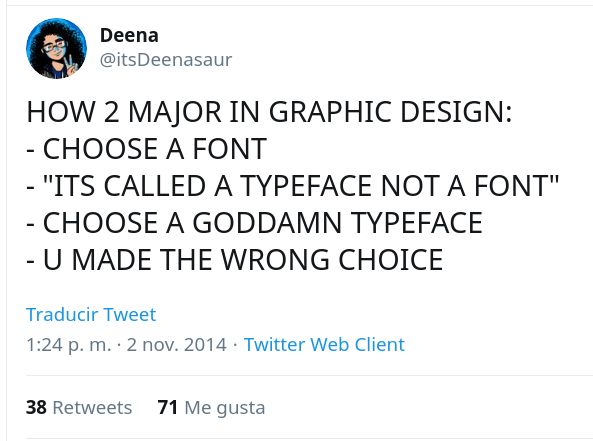
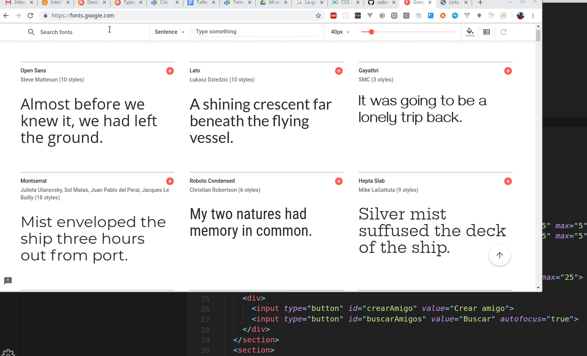

# Taller Maquetado Web

## Etapa 1: Elegir la tipografía

En esta etapa vamos a elegir una tipografía que le de identidad a nuestra aplicación. Originalmente nombramos `font` a este branch, pero en el proceso revisamos que hay diferencias entre

- el **typeface**: 
- la **fuente** (font): un tamaño o estilo específico de un _typeface_ que puede ser _regular_, _bold_, _italic_, etc.

## Lo importante es el camino

Como [bien cuenta el artículo de Taimur Abdaal](https://css-tricks.com/typography-for-developers/), no es simple elegir una tipografía y en Twitter circula este meme



Es decir, seguramente elijamos un _typeface_ que a priori nos parece _cool_ (yo mismo elegí la `Comfortaa` para la wiki de Uqbar, y un mes después me arrepentí), pero en el camino aprendemos que hay tipografías con fuerte personalidad y otros que facilitan mucho más la lectura.

## Dónde buscar

Hay tipografías pagas y otras gratuitas, nosotros vamos a elegir las segundas. Hay varios sitios web que se pueden visitar, nosotros elegimos

```html
https://fonts.google.com/
```

que provee más de 900 fonts (se pueden buscar por diferentes categorías).

## Antes que nada

Vamos a agregar una referencia a nuestro archivo de estilos custom (css) desde el HTML:

```html
<!DOCTYPE html>
<html>

<head>
  <meta charset="UTF-8">
  <title>Lista de amigos</title>
  <!-- agregamos el archivo apuntado -->
  <link href="css/style.css" rel="stylesheet">
  <!-- fin de agregado -->
```

## Ahora sí, elegimos el archivo



Ahora sí, seleccionamos una fuente, cuando lo hacemos nos permite copiar dos partes

- el link a la definición de la tipografía, que se incorpora en la sección `head` del HTML: si bien se descarga de un servidor web (requiere conexión a Internet), no requiere que la bajemos localmente y está alojado en servidores de alta disponibilidad y geográficamente cercanos a nuestra ubicación (CDN: Content Delivery Network), además de estar optimizado para no requerir alta necesidades de descarga.
- nuestra primera definición: `font-family`, que vamos a aplicar a **todo el documento**, por eso le aplicamos la etiqueta `body`, que baja en cascada a todos los elementos de la página

Cuando refrescamos la página vemos que todos los elementos de texto toman ese typeface. ¡Perfecto! solo que no vamos a elegir esa tipografía, sino alguna mejor, jeje...

Te dejamos que vos elijas la que más preferís.

