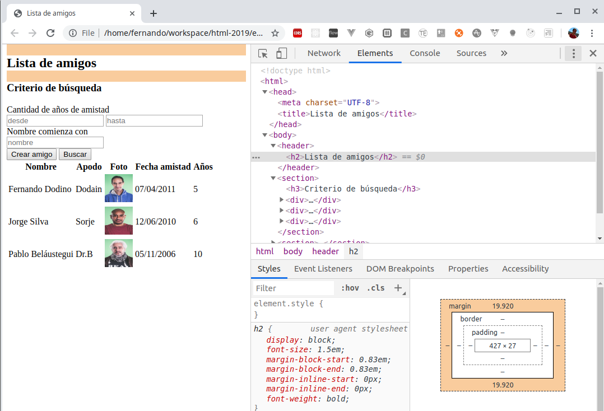
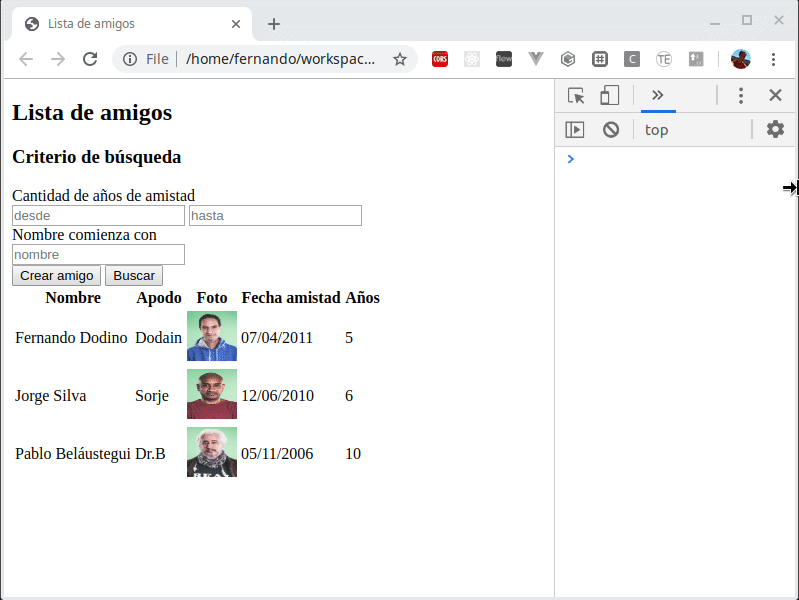
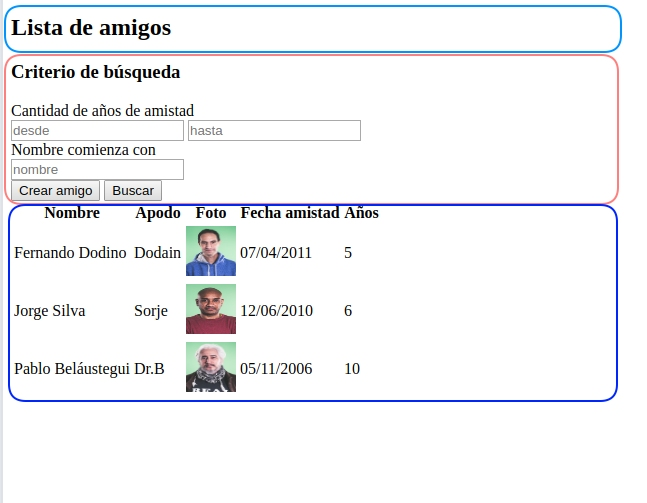

# Taller Maquetado Web

## Etapa 0

En esta versión recibimos nuestra página html inicial, que no tiene ningún tipo de estilo custom. Se trata de una página estática, donde solamente aplicaremos un diseño de contenido + estilos para que posteriormente le agreguemos la lógica de una aplicación.

## Estilo "por defecto" del browser

Si vemos la página `amiguis.html` directamente en el browser, notamos que ya el navegador le da un orden jerárquico a los elementos de nuestra página, aun cuando no hayamos definido ningún tipo de estilo:



Aquí vemos que la lista de amigos tiene un tag `<h2>` y eso implica varias definiciones:

```css
h2 {
    display: block;
    font-size: 1.5em;
    margin-block-start: 0.83em;
    margin-block-end: 0.83em;
    margin-inline-start: 0px;
    margin-inline-end: 0px;
    font-weight: bold;
}
```

esto nos recuerda la naturaleza de HTML como un lenguaje que permite describir contenido de una página.

También podés ver que la fuente por defecto es `Liberation Serif`, y esto **también lo decide el navegador** (hace un tiempo atrás la fuente predeterminada era Times New Roman).

## Modos de display

En el ejemplo anterior, `h2` tiene por defecto la propiedad `display: block`, lo que significa que el título ocupa una línea entera (un bloque), aunque su tamaño en ancho y alto puede modificarse. También los `div`s tienen esta modalidad de display por defecto. Por el contrario, los textos libres suelen tener como default el `display: inline`, por lo que fluyen a través de la página sin ocupar un espacio fijo.

Si bien hay [muchas otras configuraciones posibles para el atributo display](https://www.geeksforgeeks.org/css-display-property/), más adelante trabajaremos con `display: flex` ya que es la variante más simple y dinámica para definir un layout.

## Responsiveness

Si modificamos el ancho y alto del navegador, es poca la diferencia que notamos: solamente se acomoda el layout de los botones de la búsqueda (uno abajo del otro) y los elementos que están en la tabla.



Preparar la página para los diferentes tipos de dispositivos requiere algo más de trabajo.

## Semántica de la página



Si intentamos ver la página como un cuadro, reconoceremos tres o cuatro secciones principales:

- el título
- el panel de búsqueda (podríamos separar la botonera o considerar que es parte del panel)
- la tabla de resultados

No obstante, las secciones están juntas, quizás demasiado lo que dificulta que el contenido semántico de la página quede claro. Y está claro que el espacio de la página está totalmente desaprovechado.

## Cosas que queremos trabajar

- Elegir la tipografía
- Elegir una paleta de colores para títulos, texto, botones, etc.
- Aprovechar los anchos de la página y que quede claro el contenido de la página
- Estilos para los controles: botones, inputs, etc.
- Pensar en tarjetas más que en filas de una tabla
- BONUS: Pensar cómo se puede ver la parte móvil
