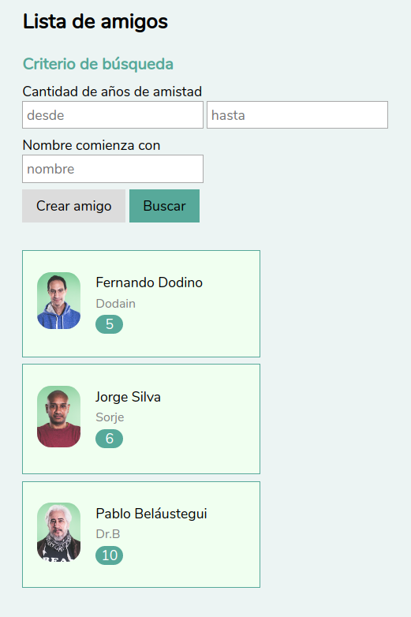

# Taller Maquetado Web

## Etapa 4: ¡Refactor de css!

En lugar de presentar los resultados como filas de una tabla, vamos a tratar de representar a cada persona con una tarjeta: el layout tiene que cambiar

- la foto podemos ubicarla a la izquierda
- a la derecha podemos poner: la persona con letra más grande, el apodo con un tamaño más pequeño y en gris, y un recuadro con la cantidad de años en los que nos conocemos.

Esto cambia a priori el html, porque la información será diferente y recordemos que html es un lenguaje que sirve para describir el contenido de una página.

Pero además, no queremos una tabla, la tarjeta debería ser lo suficientemente representativa...

Cambiamos el html a

```html
<section>
    <div class="tarjeta">
      <div class="foto">
        
      </div>
      <div class="datos">
        <div class="titulo">Fernando Dodino</div>
        <div class="subtitulo">Dodain</div>
        <div class="badge">5</div>
      </div>
    </div>
    <div class="tarjeta">
      <div class="foto">
        
      </div>
      <div class="datos">
        <div class="titulo">Jorge Silva</div>
        <div class="subtitulo">Sorje</div>
        <div class="badge">6</div>
      </div>
    </div>
    <div class="tarjeta">
      <div class="foto">
        
      </div>
      <div class="datos">
        <div class="titulo">Pablo Beláustegui</div>
        <div class="subtitulo">Dr.B</div>
        <div class="badge">10</div>
      </div>
    </div>
  </section>
```

¿Y cómo se ve?


Bueno, está mal pero no taaan mal.

## Cambiando el layout

Display flex nos puede ayudar a ordenar la tarjeta:

- primero necesitamos que la tarjeta tenga layout horizontal
- luego los datos deben tener un layout vertical

```css
.tarjeta {
  display: flex;
  flex-direction: row;
}

.datos {
  display: flex;
  flex-direction: column;
}
```

Para que se vea un poco mejor le agregaremos algo de espacio, jugamos con el título, subtítulo y badge:

```css
.tarjeta {
  display: flex;
  flex-direction: row;
  flex-wrap: wrap;
  background-color: honeydew;
  border: 1px solid #57A99A;
  padding: 1rem;
  width: 15rem;
}

.datos {
  display: flex;
  flex-direction: column;
  margin-left: 1rem;
}

.titulo, .subtitulo, .badge {
  margin: 0.1rem;
}

.subtitulo {
  color: grey;
  font-size: 0.9rem;
}

.badge {
  background-color: #57A99A;
  color: white;
  border-radius: 1rem;
  width: 2rem;
  text-align: center;
}
```

Ya se ve mejor, ¿no?


